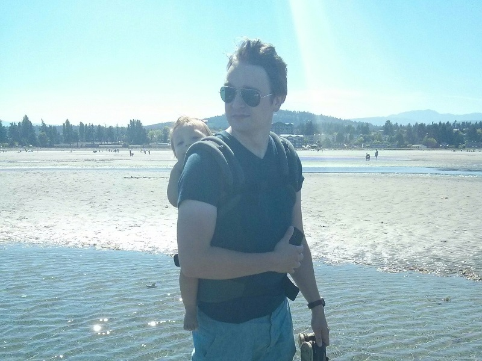

> Me and my daughter back in August 2016.

Hi, I'm James Watkins. I'm originally from Vancouver, British Columbia, but I currently live on Vancouver Island. I studied sociology at the University of Victoria where I completed a B.A. (Hons) and am just finishing my M.A. Most of my projects were oriented toward gerontology and demography, but I'm always looking to apply my skills and expertise elsewhere!

I have many years experience using Stata, SAS, and SPSS for statistical analysis. I dabble in Python, JavaScript, and R for hobbyist applications, some of which you might find on this site. I like to use Plotly to make pretty (and sometimes interactive) visualizations. I like to mess around with GIS, but I consider myself a newbie on that front. I also help my 3-year-old daughter create animations using Scratch Jr (mostly fish races).

On the hardware side, I typically use the Arduino and Raspbery Pi platforms for electronics and IoT projects. I like to take things apart and learn about them, or scavenge spare parts. Recently I've experimented with LCD transparency, electrochromic materials, and image projection onto glass. I build and maintain the desktop computers in my household. My homelab doesn't consist of much at the moment: 'production' services include Plex and game servers, 'development' consists of some old enterprise network equipment, a Raspberry Pi, an old laptop, and an old HP desktop. But hey, I'll get there eventually.

I consider myself an amateur astronomer. In the summer of 2018 I saw Jupiter's four visible moons (Io, Europa, Ganymede, and Callisto) and Saturn's rings with my own eyes for the first time. I'm currently using a pair of binoculars and a Celestron AstroMaster 130 Newtonian reflector telescope. I'm beginning to dabble in astrophotography, but I'm not very good at it yet. I like to keep up with dwarf planet and exoplanet news, and I chart nearby star systems in 3D.

My favourite authors include J.R.R. Tolkien and Terry Pratchett. My favourite poets are Siegfried Sassoon and Robert Graves. My favourite social theorists are Zygmunt Bauman and Pierre Bourdieu.

 
### About this site
This site was originally conceived in 2015, but went offline after a year - I simply felt I didn't have much use for a permanent online presence and had better things to be doing (e.g. grad school). Instead, when I felt like sharing a project or write-up, I'd inundate a small Discord community of interested people with messages. At some point I realized that Discord is not a great way to store work permanently. Thus, this site.

Inaugurated June 19, 2019.

This site is built with [Jekyll](https://jekyllrb.com/), a static site generator written in Ruby. Hosting provided by [GitHub Pages](https://pages.github.com/). I'm currently using the [Hydeout](https://github.com/fongandrew/hydeout) theme with modifications. See the source code [here](https://github.com/partywhale/partywhale.github.io).
